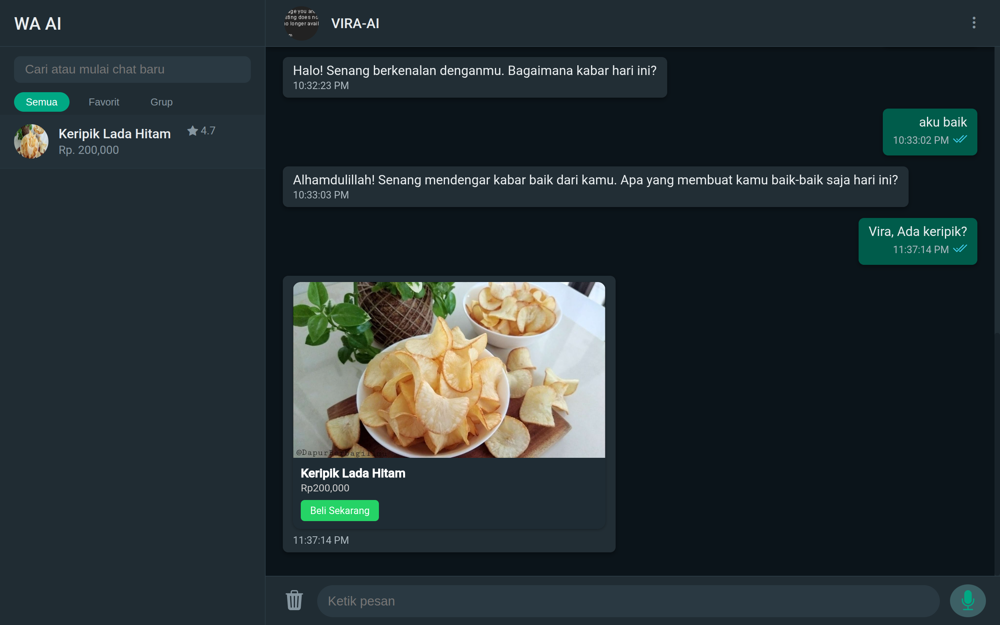
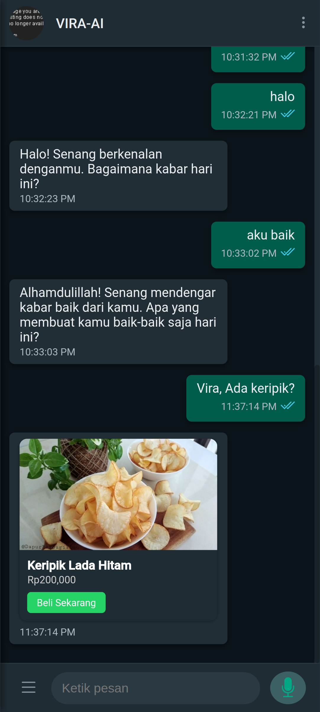

# 🧠 VIRA - Asisten Chat AI untuk Toko Online

**VIRA** adalah proyek open source yang menggabungkan kekuatan AI + Firebase + UI modern untuk menciptakan asisten belanja interaktif berbasis chat.

|             VIRA-AI            |          VIRA-mobile           |
|--------------------------------|--------------------------------|
|||


## 🎯 Fitur Utama

- 💬 Chat AI (menggunakan OpenAI/Groq via backend)
- 🛍️ Rekomendasi produk otomatis berdasarkan kata kunci
- 🔍 Pencarian dan filter produk dari sidebar
- 🧑‍💼 Login User (Google Auth) & Admin (Email+Password)
- 🛒 CMS Produk (CRUD via Firestore)
- 🛡️ Role-Based Access: Admin & User
- ✅ Firestore rules aman dan fleksibel

## 🔥 Tech Stack

- **Frontend:** HTML, Bootstrap 5, Vanilla JS, Ionic UI
- **Backend:** Firebase Auth + Firestore
- **Hosting:** GitHub Pages + Workers (untuk AI endpoint)

## 🔐 Autentikasi

- Login User: Google Sign-In (tanpa registrasi manual)
- Login Admin: Email + Password (verifikasi `isAdmin: true` di Firestore)

## 🔧 Struktur Koleksi Firestore

```
users/{uid} {
  name, email, photo, role, isAdmin, lastLogin
}
produk/{slug} {
  nama, harga, gambar, link, deskripsi, tags[]
}
chats/{uid}/messages/{id} {
  role: user|assistant, content, timestamp
}
```

## 🚀 Deploy

1. Aktifkan Firebase Auth & Firestore
2. Masukkan konfigurasi ke dalam `firebaseConfig`
3. Jalankan di GitHub Pages (static hosting)
4. Backend AI diatur via Cloudflare Workers / Vercel Functions

## 📦 Direktori Penting

```
/              - UI Chat VIRA
/admin/        - CMS Produk
/auth/         - Login User & Admin
/_includes     - Komponen Jekyll
/_layouts      - Template utama
```

## 🛡️ Keamanan

- Semua aksi tulis hanya oleh `isAdmin: true`
- Users hanya bisa baca produk & akses datanya sendiri
- Firebase rules sudah diatur aman

## 🙌 Kontribusi

Feel free to fork, sesuaikan, dan kontribusi!

## 📄 Lisensi

MIT License — bebas dipakai, dikembangkan, bahkan dijual 😉
